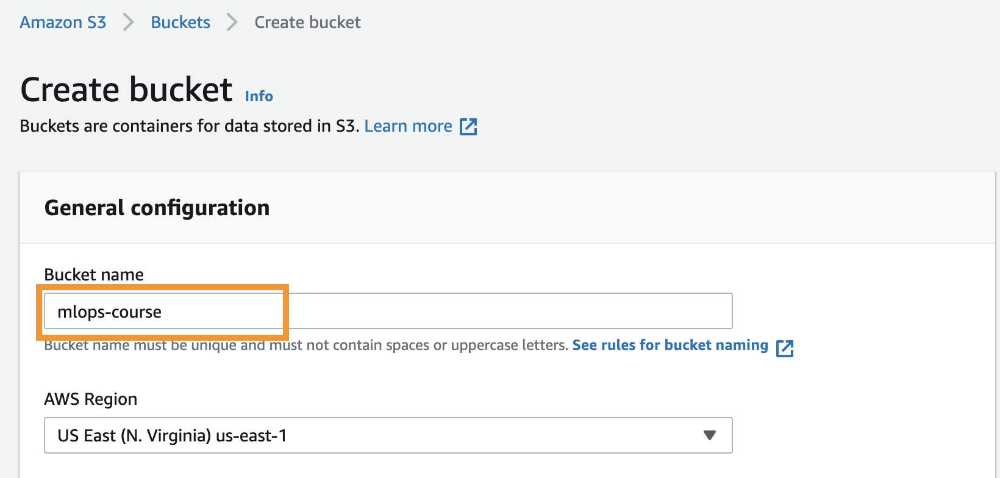
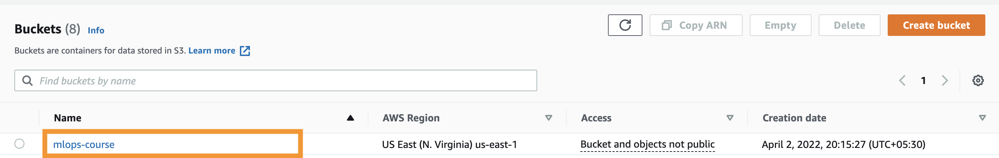

# Packaging

## Why Packaging?

Application needs to be deployed in different machines (VM’s, other laptops etc) which don’t have the necessary dependencies and it might be running on different configuration(OS, CPU’s, etc). 
To run the applications in different machines, it has to have same environment as it was running on the host side. 
Installing dependencies, configuring things for each machine is difficult and not scalable. 
The way to tackle this problem is `packaging`, also commonly known as `containerisation`

## Machine Learning Model

Before going into the techincal part, let's take a look into machine learning model. 

Here we are exploring `Question-Answering` in NLP.

Question Answering models can retrieve the answer to a question from a given context.


Here question is passed along with the context to the model. Model encodes the data and predicts the start and end index of the answer in the context. The data present in the start_idx and end_idx is taken from the context and is outputted as answer.

Refer to `model.py` file for related code.

## Setup

Create a virutal enviornment using conda as below
```
conda create --name mlops python=3.8
conda activate mlops
```

Install the requirements needed
```
pip install -r requirements.txt
```

## Running

```python
python src/model.py
```

This will download the model `deepset/roberta-base-squad2` from huggingface.


# Docker

Docker is a container management tool, which packages the application code, configuration, and dependencies into a portable image that can be shared and run on any platform or system.

There are three main things in docker:

- `DockerFile`: contains the list of commands to run which are necessary for the application to run (like dependencies, codes, command to run etc.)

- `Docker Image`: is a lightweight, standalone, executable package of software (built using dockerfile) that includes everything needed to run an application: code, runtime, system tools, system libraries, and settings.

- `Docker Container`: is an instance of Docker Image which contains the running application.


Let's see how to create each one of them.

## DockerFile

A simple file that consists of instructions to build a Docker Image. Each instruction in a docker file is a command/operation, for example, what operating system to use, what dependencies to install or how to compile the code, and many such instructions which act as a layer.

Let's see how to create a docker file for our application.

Create a file called `Dockerfile` and copy/paste the below content.
```dockerfile
FROM python:3.8
COPY ./ /app
WORKDIR /app
RUN pip install -r requirements.txt
ENV LC_ALL=C.UTF-8
ENV LANG=C.UTF-8
CMD ["python3", "src/model.py"]
```

- `FROM:` creates a layer from the base image, here we have used python:3.8 as base image. This is pulled from Docker Hub. 

- `COPY:` Here the current directory files are copied to the container’s app directory. This will be added as a separate layer while building the image and is cached.

- `WORKDIR:` specifies the working directory in the container.

- `RUN:` specifies what commands to run within the container, here running pip command to install dependencies from requirements.txt file which is needed to run the application.

- `ENV`: specifies what enviornment variables to set inside docker container. Here LC_ALL, LANG are set to UTF-8.

- `CMD:` specifies what command to run at the start of the container.

## Docker Image

Docker image is a file comprised of multiple layers which can execute applications in a single instance. It includes all dependencies, configuration, scripts, binaries, etc. necessary for running an application. The image also contains other configuration for the container, such as environment variables, a default command to run, and other metadata.

Here instructions are provided in dockerfile. Let's create docker image using dockerfile. Run the following command:

```
docker build -t qa:test -f dockerfiles/Dockerfile .
```

The above command builds the docker image using Dockerfile and assigns a tag to the created image `qa:test`

Check the list of all available docker images using the command:

```
docker images
```

If the dockerfile name is created with different name, then the above command might not work. In that case, we have to explicitly provide the dockerfile name as well like below

```
docker build -t qa:test -f docker_other_file .
```

The `.` in the end, provides the build context for docker. In the dockerimage, there is a command `COPY ./ /app`, here `./` maps to `.` in the docker build command. So if you want to run the docker build command from a different place, then this build context path needs to be modified accordingly.


## Docker Container

Docker Container is a runnable instance of an image. 

- Can be run on local machines, virtual machines or deployed to the cloud.

- Is portable (can be run on any OS)

- Containers are isolated from each other and run their own software, binaries, and configurations.

Let's create a docker container using the docker image builded in the previous step.

```
docker run --name qa_container qa:test
```

Here `--name` indicates the name of the container and also need to provide what docker image to use to create the container.

Running the docker image `qa:test` will execute the code since it is provided as instruction via `CMD` in dockerfile. So the above command should output something like

```
(mlops) ➜  chapter-4 git:(chapter-4/packaging) ✗ docker run --name qa_container qa:test             
{"message": "Loading model: deepset/roberta-base-squad2", "levelname": "INFO", "filename": "model.py", "module": "model", "lineno": 13, "funcName": "<module>", "timestamp": "2022-05-22T11:05:09.742508+00:00"}
Downloading: 100%|██████████| 571/571 [00:00<00:00, 497kB/s]
Downloading: 100%|██████████| 473M/473M [00:08<00:00, 56.7MB/s] 
Downloading: 100%|██████████| 79.0/79.0 [00:00<00:00, 63.7kB/s]
Downloading: 100%|██████████| 878k/878k [00:00<00:00, 46.4MB/s]
Downloading: 100%|██████████| 446k/446k [00:00<00:00, 42.8MB/s]
Downloading: 100%|██████████| 772/772 [00:00<00:00, 674kB/s]
{"message": "Received question: Why is model conversion important?", "levelname": "INFO", "filename": "model.py", "module": "model", "lineno": 28, "funcName": "get_answer", "timestamp": "2022-05-22T11:05:21.179179+00:00"}
{"message": "Received context: The option to convert models between FARM and transformers gives freedom to the user and let people easily switch between frameworks.", "levelname": "INFO", "filename": "model.py", "module": "model", "lineno": 29, "funcName": "get_answer", "timestamp": "2022-05-22T11:05:21.179406+00:00"}
{"message": "Predicted answer:  gives freedom to the user", "levelname": "INFO", "filename": "model.py", "module": "model", "lineno": 39, "funcName": "get_answer", "timestamp": "2022-05-22T11:05:21.487666+00:00"}

Question:  Why is model conversion important?

Context:  The option to convert models between FARM and transformers gives freedom to the user and let people easily switch between frameworks.

Answer:   gives freedom to the user
```


List all the docker containers using the command

```
docker ps -a
```

What we have done so far looks like this


The model is downloaded while running the container. We will explore how to upload & download from a remote storage (s3) instead of downloading it in docker image.

# Remote Storage

Remote storage, also known as cloud storage, is a description of storage accessed over a network (remotely). It can help in deploying large amounts of data to other servers that are located in the same remote zone.

## S3

Amazon Simple Storage Service (S3) is a storage for the internet. It is designed for large-capacity, low-cost storage provision across multiple geographical regions.


We have the model in our cache dir `TRANSFORMERS_CACHE`. The default directory where the model is downloaded is `~/.cache/huggingface/transformers/`. One simple way is to package the model in dockerimage so that it won't be downloaded everytime from huggingface. But this is not a standard approach. There could be multiple models and we cannot package each and every model. Also we should not download from huggingface repo everytime. Better solution to this is to maintain all the models in a remote storage and load the model from there as and when needed.

For this to happen, we need to first upload the models to remote storage (S3).

Let's build the following architecture


## Uploading model to S3

Let's save the models in a specific folder `models`.

Create a file named `save_model.py` in src folder with the following code

```python
import os
from transformers import AutoModelForQuestionAnswering, AutoTokenizer
from helpers import create_logger

logger = create_logger(project_name="qa_model", level="INFO", json_logging=True)

model_name = "deepset/roberta-base-squad2"
logger.info(f"Loading model: {model_name}")
model = AutoModelForQuestionAnswering.from_pretrained(model_name)
tokenizer = AutoTokenizer.from_pretrained(model_name)

root_dir = os.path.realpath(os.path.join(os.path.dirname(__file__), '..'))
model_dir = os.path.join(root_dir, 'models')
save_path = os.path.join(model_dir, model_name)
print(f"Saving models in: {model_dir}")
print(f"Saving model: {model_name} in {save_path}")

tokenizer.save_pretrained(save_path)
model.save_pretrained(save_path)
```

Run the code

```
python src/save_model.py
```

This will download the model from huggingface. If the model is already downloaded it will be present in cache directory `~/.cache/huggingface/transformers/`. Then it will save the model in `models` directory.


Now we need to save this model in S3.

Data in S3 is organized in the form of buckets.

- A Bucket is a logical unit of storage in S3.

- A Bucket contains objects which contain the data and metadata.

Before adding any data in S3 the user has to create a bucket which will be used to store objects.

#### Creating bucket

- Sign in to the AWS Management Console and open the Amazon S3 console at https://console.aws.amazon.com/s3/

- Click on `Create Bucket`


- Bucket name details


- Created bucket


#### Programmatic access

Credentials are required to access any aws service. There are different ways of configuring credentials. Let's look at a simple way.

- Go to My Security Credentials


- Navigate to `AWS IAM Credentials` section and click on `Create cccess key button`.

  - This will download a csv file containing the AWS_ACCESS_KEY_ID and AWS_SECRET_ACCESS_KEY

- Set the ACCESS key and id values in environment variables.

```
export AWS_ACCESS_KEY_ID=<ACCESS KEY ID>
export AWS_SECRET_ACCESS_KEY=<ACCESS SECRET>
```

**Do not share the secrets with others**

#### Accessing s3 using CLI

Download the AWS CLI package and [install it from here](https://aws.amazon.com/cli/)

aws cli comes with a lot of commands. [Check the documentation here](https://docs.aws.amazon.com/cli/latest/index.html)


#### Push the model to s3

Navigate to the models directory where the model is downloaded and then run the following script. 

```
aws cp models s3://mlops-course/models/ --recursive
```


Here `models` is the folder name to copy to s3, `--recursive` option for pushing all the files in a folder.

## Downloading model from S3

Now that the model is present in s3, we need to modify the code such that the model is downloaded from s3 instead of huggingface.

Let's create a helper method for downloading the model from s3 in `src/helpers.py`

```python
def download_model_from_s3(
    model_name: str,
    download_folder: str = "./models",
    s3_bucket: str = "mlops-course/models",
) -> str:
    """Downloads model from s3 bucket based on given arguments and saves in default download folder
    Args:
        model_name (str): Name of model to be loaded
        download_folder (str)(Optional): Path where model will be downloaded
        s3_bucket (str)(Optional): S3 bucket name where the model is present. Defaults to mlops-course/models
    Return:
        str: Path where model is downloaded
    """
    logger = create_logger(project_name="download_model", level="INFO", json_logging=True)
    model_path = download_folder
    os.makedirs(model_path, exist_ok=True)

    ## If the folder already contains model files return model_path
    if os.listdir(model_path):
        logger.info(f"Model already exists at {model_path} skipping the downloading...")
        return model_path

    shutil.rmtree(model_path)

    remote_directory = f"s3://{s3_bucket}/{model_name}"

    logger.info(f"Downloading the model from: {remote_directory} to {model_path}")
    download_s3_folder(
        s3_bucket,
        model_name=model_name,
        local_dir=model_path,
    )

    return model_path
```

The above code downloads the model into `models/<model_name>` folder from s3. If the model is already present in local, then it will skip the download.

Let's modify the model code as well to load from s3 instead of hugging face. Let's create a file called `src/improved_model.py`

```python
from helpers import download_model_from_s3

logger = create_logger(project_name="qa_model", level="INFO", json_logging=True)

model_name = "deepset/roberta-base-squad2"
root_dir = os.path.realpath(os.path.join(os.path.dirname(__file__), '..'))
model_dir = os.path.join(root_dir, 'models')
save_path = os.path.join(model_dir, model_name)

# downloading model from s3
model_path = download_model_from_s3(model_name=model_name, download_folder=save_path)

model = AutoModelForQuestionAnswering.from_pretrained(model_path)
tokenizer = AutoTokenizer.from_pretrained(model_path)
```

In order to test that code is actually downloading model from s3 instead of huggingface (or) loading from local, let's delete the folder `models` with the following command

```
rm -rf models
```

Now let's run the code 

```
python src/improved_model.py
```

This should show output something like:

```
{"message": "Downloading the model from: s3://mlops-course/models/deepset/roberta-base-squad2 to /app/models/deepset/roberta-base-squad2", "levelname": "INFO", "filename": "helpers.py", "module": "helpers", "lineno": 181, "funcName": "download_model_from_s3", "timestamp": "2022-05-22T10:51:43.858531+00:00"}
{"message": "Downloading...", "levelname": "INFO", "filename": "helpers.py", "module": "helpers", "lineno": 148, "funcName": "download_s3_folder", "timestamp": "2022-05-22T10:51:43.989241+00:00"}
{"message": "Download complete!", "levelname": "INFO", "filename": "helpers.py", "module": "helpers", "lineno": 150, "funcName": "download_s3_folder", "timestamp": "2022-05-22T10:51:50.212395+00:00"}
{"message": "Received question: Why is model conversion important?", "levelname": "INFO", "filename": "improved_model.py", "module": "improved_model", "lineno": 35, "funcName": "get_answer", "timestamp": "2022-05-22T10:51:52.095135+00:00"}
{"message": "Received context: The option to convert models between FARM and transformers gives freedom to the user and let people easily switch between frameworks.", "levelname": "INFO", "filename": "improved_model.py", "module": "improved_model", "lineno": 36, "funcName": "get_answer", "timestamp": "2022-05-22T10:51:52.095333+00:00"}
{"message": "Predicted answer:  gives freedom to the user", "levelname": "INFO", "filename": "improved_model.py", "module": "improved_model", "lineno": 46, "funcName": "get_answer", "timestamp": "2022-05-22T10:51:52.374544+00:00"}

Question:  Why is model conversion important?

Context:  The option to convert models between FARM and transformers gives freedom to the user and let people easily switch between frameworks.

Answer:   gives freedom to the user
```

If you run it again, it will check the local first and skips the download if the model is already present.

```
(mlops) ➜  chapter-4 git:(chapter-4/packaging) ✗ python src/improved_model.py  
{"message": "Model already exists at /home/ubuntu/MLOps-Course/chapter-4/models/deepset/roberta-base-squad2 skipping the downloading...", "levelname": "INFO", "filename": "helpers.py", "module": "helpers", "lineno": 173, "funcName": "download_model_from_s3", "timestamp": "2022-05-22T11:45:41.924093+00:00"}
```


## Dockerfile Update

Since we need to download the model from s3 instead of huggingface, the container should have the required permissions to access the model from s3.

```dockerfile
FROM python:3.8

ARG AWS_ACCESS_KEY_ID
ARG AWS_SECRET_ACCESS_KEY
ENV AWS_ACCESS_KEY_ID=$AWS_ACCESS_KEY_ID \
    AWS_SECRET_ACCESS_KEY=$AWS_SECRET_ACCESS_KEY

COPY ./ /app
WORKDIR /app
RUN pip install -r requirements.txt
ENV LC_ALL=C.UTF-8
ENV LANG=C.UTF-8
RUN mkdir models
RUN chmod -R 0777 models
CMD ["python3", "src/improved_model.py"]
```

The change from prior dockerfile is:

- `ARG AWS_ACCESS_KEY_ID`: This is for authenticating AWS so that it can access s3 bucket. These are called arguments.

- `ARG AWS_SECRET_ACCESS_KEY`: Used for AWS authentication.

- `ENV AWS_ACCESS_KEY_ID=$AWS_ACCESS_KEY_ID \
  AWS_SECRET_ACCESS_KEY=$AWS_SECRET_ACCESS_KEY`: Setting the creds in docker image as Enviornment variables.

- `RUN mkdir models`: Creates the models directory in docker image

- `RUN chmod -R 0777 $MODEL_DIR`: This is for giving permissions to the models directory. So that at run time models can be downloaded and written to this directory.

- `RUN python3 src/improved_model.py`: This will check whether the model is downloading from s3 properly or not.


### Building DockerImage

Ensure the AWS Secrets are set using the following command

```
export AWS_ACCESS_KEY_ID=<ACCESS KEY ID>
export AWS_SECRET_ACCESS_KEY=<ACCESS SECRET>
``` 

Now let's build the docker image using the command

```
docker build --build-arg AWS_ACCESS_KEY_ID=$AWS_ACCESS_KEY_ID --build-arg AWS_SECRET_ACCESS_KEY=$AWS_SECRET_ACCESS_KEY -t qa_improved:test -f dockerfiles/improved.Dockerfile .
```

### Running the docker container

Let's create a docker container using the docker image builded in the previous step.

```
docker run --name qa_improved_container qa_improved:test
```

This will show output like:

```
(mlops) ➜  chapter-4 git:(chapter-4/packaging) ✗ docker run --name qa_improved_container qa_improved:test
{"message": "Downloading the model from: s3://mlops-course/models/deepset/roberta-base-squad2 to /app/models/deepset/roberta-base-squad2", "levelname": "INFO", "filename": "helpers.py", "module": "helpers", "lineno": 181, "funcName": "download_model_from_s3", "timestamp": "2022-05-22T10:51:43.858531+00:00"}
{"message": "Downloading...", "levelname": "INFO", "filename": "helpers.py", "module": "helpers", "lineno": 148, "funcName": "download_s3_folder", "timestamp": "2022-05-22T10:51:43.989241+00:00"}
{"message": "Download complete!", "levelname": "INFO", "filename": "helpers.py", "module": "helpers", "lineno": 150, "funcName": "download_s3_folder", "timestamp": "2022-05-22T10:51:50.212395+00:00"}
{"message": "Received question: Why is model conversion important?", "levelname": "INFO", "filename": "improved_model.py", "module": "improved_model", "lineno": 35, "funcName": "get_answer", "timestamp": "2022-05-22T10:51:52.095135+00:00"}
{"message": "Received context: The option to convert models between FARM and transformers gives freedom to the user and let people easily switch between frameworks.", "levelname": "INFO", "filename": "improved_model.py", "module": "improved_model", "lineno": 36, "funcName": "get_answer", "timestamp": "2022-05-22T10:51:52.095333+00:00"}
{"message": "Predicted answer:  gives freedom to the user", "levelname": "INFO", "filename": "improved_model.py", "module": "improved_model", "lineno": 46, "funcName": "get_answer", "timestamp": "2022-05-22T10:51:52.374544+00:00"}

Question:  Why is model conversion important?

Context:  The option to convert models between FARM and transformers gives freedom to the user and let people easily switch between frameworks.

Answer:   gives freedom to the user
```


# Conainer Registry

A container registry is a place to store docker images. Docker image is a file comprised of multiple layers which can execute applications in a single instance. Hosting all the images in one stored location allows users to commit, identify and pull images when needed.

AWS version of container registry is ECR which stands for Elastic Container Registry.


## Uploading Docker Image to ECR

- Sign in to the AWS Management Console and open the Amazon ECR console at https://console.aws.amazon.com/ecr/

- Create a repository when prompted with name `mlops-course`


Commands required to push the image to ECR can be found in the ECR itself

- Authenticating docker client to ECR

```
aws ecr get-login-password --region us-west-2 | docker login --username AWS --password-stdin 246113150184.dkr.ecr.us-west-2.amazonaws.com
```

- Tagging the image

```
docker tag qa_improved:test 246113150184.dkr.ecr.us-west-2.amazonaws.com/mlops-course:latest
```

- Pushing the image

```
docker push 246113150184.dkr.ecr.us-west-2.amazonaws.com/mlops-course:latest
```

## Summary

Let's summarise what we have done so far:

1. We have taken a NLP problem and have a model which solves that.

2. We packaged the model using docker

3. We explored remote storage S3 for storing the models

4. We modified code to fetch the model from S3

5. We modified the dockerfile to fetch the model from S3

6. We pushed the docker image to container register ECR


Now that the docker image is updated with the code and pushed to ECR, we need to create container with that image. There are different ways of doing it. We will explore deploying methods like with Kubernetes (EKS), Serverless (Lambda) in the coming chapters. We will also look into how to configure CI/CD using GitHub Actions for automating the docker image building and pushing to ECR. 
