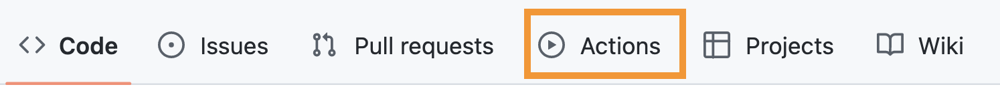
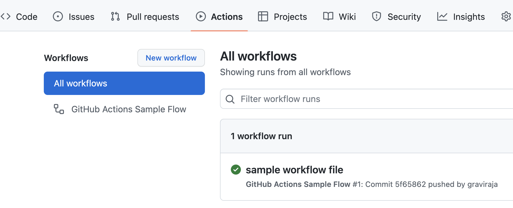
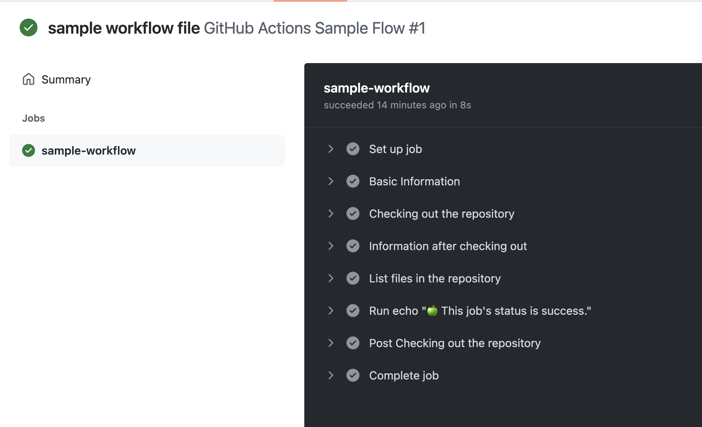

# What is CI/CD ?

CI/CD is a coding philosophy and set of practices with which you can continuously build, test, and deploy iterative code changes.

This iterative process helps reduce the chance that you develop new code based on buggy or failed previous versions. With this method, you strive to have less human intervention or even no intervention at all, from the development of new code until its deployment.


## Basics of GitHub Actions


Since we are Github for version control system, we can use GitHub Actions right off the bat without having the need to setup another tool. (Might not be the same if you are using different version control system.)

GitHub Actions are just a set instructions declared using `yaml` files.

These files needs to be in a specific folder: `.github/workflows` and this has to be in the root directory (where `.git` folder is present).

There are 5 main concepts in GitHub Actions:

- `Events`: An event is a trigger for workflow.

- `Jobs`: Jobs defines the steps to run when a workflow is triggered. A workflow can contain multiple jobs.

- `Runners`: Defines where to run the code. By default, github will run the code in it's own servers.

- `Steps`: Steps contains actions to run. Each job can contains multiple steps to run.

- `Actions`: Actions contains actual commands to run like installing dependencies, testing code, etc.


### 

Let's create the folder using the command:

```shell
mkdir .github/workflows
```

Now let's create a basic workflow file called `sample.yaml` in that folder and paste the following content.

```yml
name: GitHub Actions Sample Flow
on: [push]
jobs:
  sample-workflow:
    runs-on: ubuntu-latest
    steps:
      - name: Basic Information
        run: |
          echo "🎬 The job was automatically triggered by a ${{ github.event_name }} event."
          echo "💻 This job is now running on a ${{ runner.os }} server hosted by GitHub!"
          echo "🎋 Workflow is running on the branch ${{ github.ref }}"
      - name: Checking out the repository
        uses: actions/checkout@v2
      - name: Information after checking out
        run: |
          echo "💡 The ${{ github.repository }} repository has been cloned to the runner."
          echo "🖥️ The workflow is now ready to test your code on the runner."
      - name: List files in the repository
        run: |
          ls ${{ github.workspace }}
      - run: echo "🍏 This job's status is ${{ job.status }}."
```

Let's understand what's happening here:

- Created a CICD workflow with `name` GitHub Actions Sample Flow

- `on` is called Event which triggers the workflow. Here it is push event. Whenever a push is happened on the repository, workflow will be triggered. There are 30+ ways of triggering the workflow. [Refer to the documentation for more information on events](https://docs.github.com/en/actions/using-workflows/events-that-trigger-workflows)

- Workflow contains a single `job` called sample-workflow `running` on ubuntu-latest

- sasic-workflow job contains multiple `steps` (Basic Information, Checking out the repository, Information after checking out, List files in the repository)

- Basic Information step contains the `actions` to do some echoing.

- Checking out the repository step contains the `action` to checkout the repository. Here we are using actions/checkoutv2 which is a open source action. [Check for other available actions here](https://github.com/marketplace?type=actions)

- Information after checking out step contains the `action` to echo some information about repository and runner.

- List files in the repository step contains the `action` to list the contents of the repository.

Commit & Push the file. Let's see how does it look in github.

On GitHub, navigate to the main page of the repository.

- Under your repository name, click Actions.



- In the left sidebar, you can see the workflows.



- Select the latest run & job of the required workflow.



## Building docker image with Github Actions

In the previous chapter (packaging) we have seen how to build the docker image and push that image to ECR. Now let's see how to automate this process using Github Actions.

We need AWS credentials for fetching the model from S3, Pushing the image to ECR. We can't share this information publicly. Fortunately GitHub Actions has a way to store these information securely using `Secrets`.

- Go to the `⚙️ Settings` tab of the repository

-

Save the following secrets:

- **AWS_ACCESS_KEY_ID**

- **AWS_SECRET_ACCESS_KEY**

- **AWS_ACCOUNT_ID** (this is the account id of profile)

These values can be used in GitHub Actions in the following manner:

- AWS_ACCESS_KEY_ID: `{{secrets.AWS_ACCESS_KEY_ID}}`

- AWS_SECRET_ACCESS_KEY: `{{secrets.AWS_SECRET_ACCESS_KEY}}`

- AWS_ACCOUNT_ID: `{{secrets.AWS_ACCOUNT_ID}}`

```yml
name: Build & Publish Image

on: [push]

jobs:
  mlops-container:
    runs-on: ubuntu-latest
    defaults:
      run:
        working-directory: ./chapter-5
    steps:
    - name: Checkout
      uses: actions/checkout@v2
      with:
        ref: ${{ github.ref }}
    - name: Configure AWS Credentials
      uses: aws-actions/configure-aws-credentials@v1
      with:
        aws-access-key-id: ${{ secrets.AWS_ACCESS_KEY_ID }}
        aws-secret-access-key: ${{ secrets.AWS_SECRET_ACCESS_KEY }}
        aws-region: us-east-1
    - name: Build image
      run: |
        docker build --build-arg AWS_ACCOUNT_ID=${{ secrets.AWS_ACCOUNT_ID }} \
                     --build-arg AWS_ACCESS_KEY_ID=${{ secrets.AWS_ACCESS_KEY_ID }} \
                     --build-arg AWS_SECRET_ACCESS_KEY=${{ secrets.AWS_SECRET_ACCESS_KEY }} \
                     --tag mlops-course .
    - name: Push2ECR
      id: ecr
      uses: jwalton/gh-ecr-push@v1
      with:
        access-key-id: ${{ secrets.AWS_ACCESS_KEY_ID }}
        secret-access-key: ${{ secrets.AWS_SECRET_ACCESS_KEY }}
        region: us-east-1
        image: mlops-course:latest
```

Let's understand what happening here:

- Jobs will run on `ubuntu-latest` runner

- Clones the code and navigates to `chapter-5` directory

- Sets the AWS environment variables using `aws-actions/configure-aws-credentials@v1` action

- Builds the image and tag it with `mlops-course` tag

- Push the image to ECR using `jwalton/gh-ecr-push@v1` action.

Output will look like:

In actions tab Github:

In the ECR:

## Summary

Let's summarise what we have done so far:

- We have looked into the basics of CICD.

- We have looked into basics of Github Actions.

- We have seen how to automatically create a docker image using GitHub Actions and save it to ECR.
