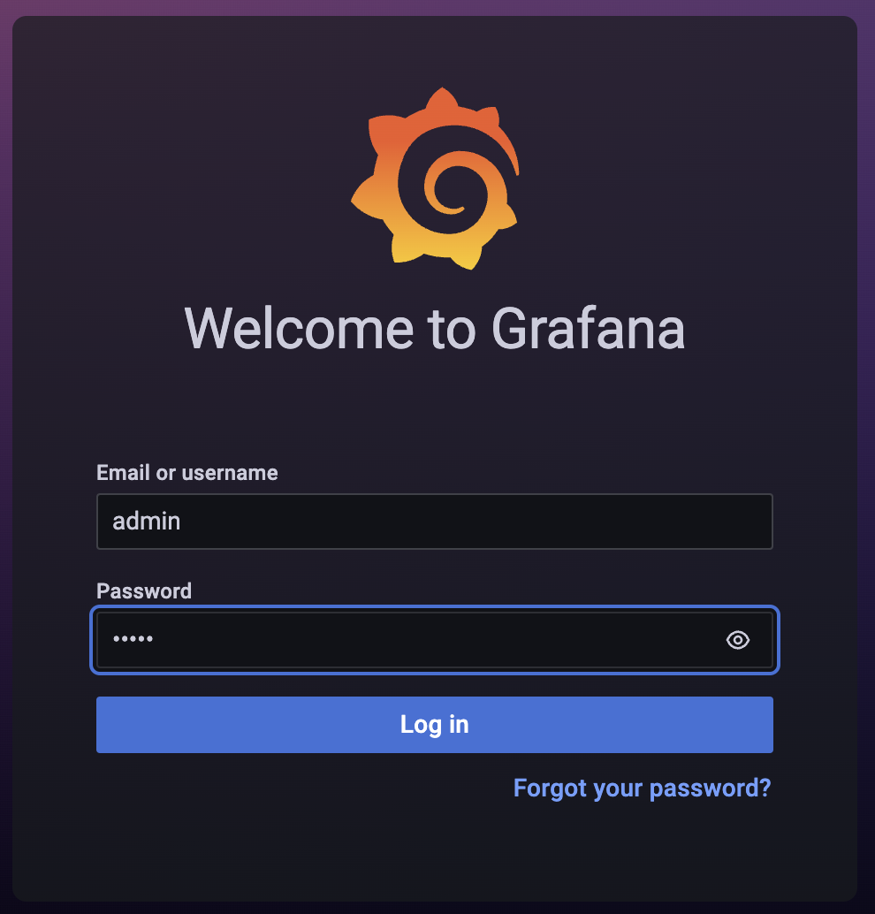
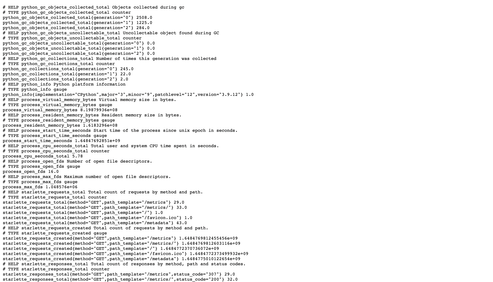

# Chapter: Deployment Monitoring

Monitor your deployments using **Grafana** and **Prometheus**.

## Requirements

To install **Docker** on your machine follow the instructions on the [official guide](https://docs.docker.com/engine/install/), having a Docker Desktop would be better since the GUI will help you understand what are the different parts. Most of the instructions in GUI can be easily mapped to more powerful CLI.

Once Docker is installed, we can simply pull the images, first we are going to run **Prometheus**.

### Prometheus

[Prometheus](https://prometheus.io/) is an opensource event monitoring and triggering alerts for time series datasets.

1. Create a file "prometheus.yml" and copy paste the content below. This is the config file and can be configured according to your needs:
```yml
# This defines the global config that will be applied to all the jobs
global:
  scrape_interval:     15s # Scrape every 15 seconds. Default is every 1 minute.
  evaluation_interval: 15s # Run rules every 15 seconds. The default is every 1 minute.

# A scrape configuration containing exactly one endpoint to scrape, the model_server
scrape_configs:
  # The job name is added as a label `job=<job_name>` to any timeseries scraped from this config.
  # You can replace it with whatever you need
  - job_name: 'model_serving'
    # metrics_path defaults to '/metrics' → not "/metrics/"
    # scheme defaults to 'http' → add a HTTPS redirect if needed

    # Override the global default and scrape targets from this job every 5 seconds.
    scrape_interval: 5s
    static_configs:
      # !~ Change according to your OS
      - targets: ['localhost:6969'] # Linux
      - targets: ['host.docker.internal:6969'] # MacOS / Windows
```
2. In order to start the Prometheus container, ensure that you transfer the file using `-v` argument. If there is no image for `prom/prometheus`, one will be downloaded automatically.
```
docker run -p 9090:9090 -v /prometheus.yml:/etc/prometheus/prometheus.yml prom/prometheus
```
3. Now you can go to `http://127.0.0.1:9090` and see the dashboard.

### Grafana

[Grafana](https://grafana.com/) is a fantastic dashboard software that is connected to datasources (like Prometheus above) and mostly used for operations monitoring in organisations across globe. In order to start a server run the commands:
```
docker run -p 3000:3000 grafana/grafana-enterprise
```

You can go to `http://127.0.0.1:3000` and will be prompted for authentication, by default the values are `admin` and `admin` for both username/password.



### Server Code

In order to log the data, we need to add some endpoint to our existing server side code, by default Prometheus will hit `/metrics` endpoint and so that is what we will add. First thing we need to install is a python package called "starlette-prometheus":
```
pip install starlette-prometheus
```

Then we will need to add the following to the server code: 
```python
from starlette_prometheus import metrics, PrometheusMiddleware
app.add_middleware(PrometheusMiddleware)
app.add_route("/metrics", metrics)
```

When you run your server and hit the endpoint you should see something like this:




